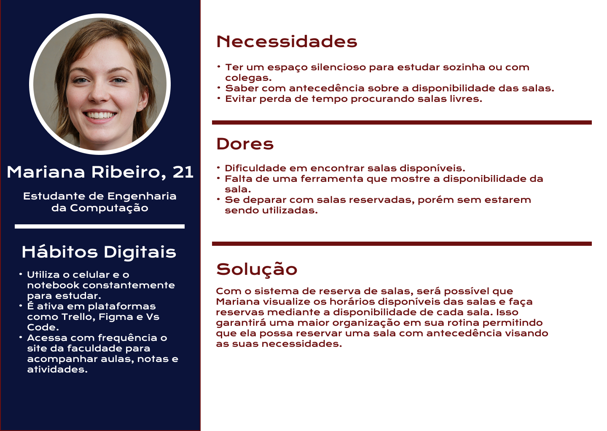
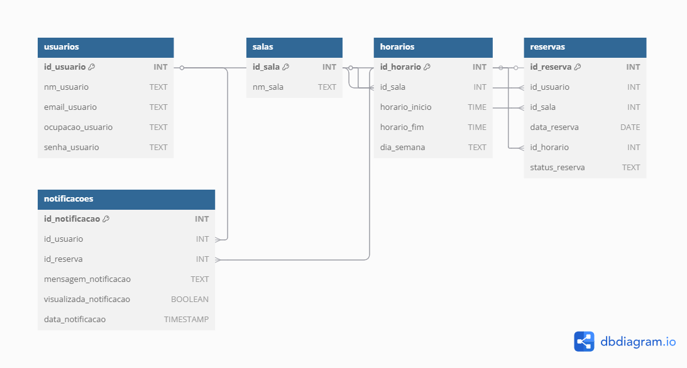
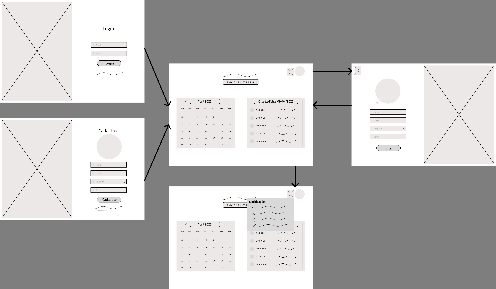
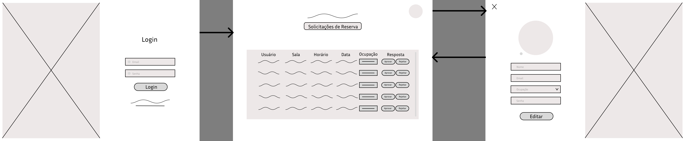

# Web Application Document - Projeto Individual - Módulo 2 - Inteli

## Checkin Room

#### Marcela Costa

## Sumário

1. [Introdução](#c1)  
2. [Visão Geral da Aplicação Web](#c2)  
3. [Projeto Técnico da Aplicação Web](#c3)  
4. [Desenvolvimento da Aplicação Web](#c4)  
5. [Referências](#c5)  

<br>

## <a name="c1"></a>1. Introdução
O sistema a ser desenvolvido tem como objetivo automatizar o processo de reserva de salas em ambientes acadêmicos ou institucionais. Atualmente, esse processo é frequentemente realizado de forma manual, o que pode acarretar em conflitos no agendamento desperdício de tempo. Com a criação desse sistema, será possível eliminar esses problemas por meio de uma plataforma digital intuitiva, que permitirá os usuários a consultarem a disponibilidade das salas em tempo real, realizar reservas facilmente e receber confirmações automáticas.

O sistema contará com funcionalidades como: dois tipos de login (usuário comum, administrador), visualização dos dias e horários disponíveis, opção para reserva mediante a disponibilidade e notificações para confirmação. O administrador terá acesso a um painel de controle para gerenciar os recursos, aprovar solicitações específicas e visualizar a posição da ocupação do usuário (estudante, professor e coordenador).

A interface será desenvolvida com foco na usabilidade, garantindo que qualquer pessoa consiga utilizar o sistema de maneira intuitiva. Dessa forma, com o processo de agendamento, o sistema proporcionará mais organização, economia de tempo e melhor aproveitamento dos espaços, contribuindo significativamente para a rotina dos usuários.

---

## <a name="c2"></a>2. Visão Geral da Aplicação Web

### 2.1. Personas

<div align="center">
  <sub>Persona</sub><br>
  
</div>

### 2.2. User Stories

**US01**  
Como estudante universitário, quero visualizar a disponibilidade das salas, para que eu possa escolher o melhor horário para estudar ou reunir meu grupo.

**US02**  
Como estudante universitário, quero poder reservar uma sala com antecedência, para que eu possa organizar a minha rotina de acordo com as minhas necessidades.

**US03**  
Como administrador, quero acessar o painel de controle, para que eu possa checar e aprovar as reservas para o uso das salas.

### Análise INVEST da User Story Prioritária

**US01 – Como estudante universitário, quero visualizar a disponibilidade das salas, para que eu possa escolher o melhor horário para estudar ou reunir meu grupo.**

- **I (Independente):** A história pode ser implementada separadamente da funcionalidade de reserva ou gestão administrativa.  
- **N (Negociável):** O formato de visualização (lista, calendário, etc.) pode ser ajustado conforme as necessidades dos usuários.  
- **V (Valiosa):** Permite que os estudantes escolham o melhor horário sem depender de terceiros, organizando melhor sua rotina.  
- **E (Estimável):** O escopo é claro e pode ser estimado pela equipe de desenvolvimento.  
- **S (Pequena):** Foca apenas na exibição da disponibilidade, sendo pequena e rápida de implementar.  
- **T (Testável):** Pode ser testada ao verificar se os horários livres estão sendo exibidos corretamente.

---

## <a name="c3"></a>3. Projeto da Aplicação Web

### 3.1. Modelagem do banco de dados

O modelo relacional a seguir apresenta a estrutura das tabelas do sistema de reserva de salas, com seus respectivos campos e relacionamentos. O sistema foi modelado para garantir integridade referencial, evitar conflitos de agendamento e permitir notificações automáticas aos usuários.

<div align="center">
  <sub>Modelo Relacional</sub><br>
  
</div>

#### Relações entre tabelas:

- **usuarios** → contém as informações de login e perfil dos usuários
- **salas** → define os ambientes disponíveis para reserva
- **horarios** → representa os horários fixos por sala e dia da semana
- **reservas** → associa usuários, salas, datas e horários em pedidos de reserva
- **notificacoes** → envia mensagens relacionadas ao status das reservas

As ligações entre tabelas utilizam chaves estrangeiras (`id_usuario`, `id_sala`, `id_horario`, `id_reserva`) para garantir consistência dos dados e facilitar o cruzamento de informações.

---

### Modelo Físico – Script SQL

Abaixo está o schema do banco de dados em SQL, que pode ser executado em Supabase ou PostgreSQL:

```sql
CREATE TABLE usuarios (
  id_usuario SERIAL PRIMARY KEY,
  nm_usuario TEXT NOT NULL,
  email_usuario TEXT UNIQUE NOT NULL,
  ocupacao_usuario TEXT NOT NULL CHECK (ocupacao_usuario IN ('aluno', 'professor', 'coordenador', 'recepcao')),
  senha_usuario TEXT NOT NULL
);

CREATE TABLE salas (
  id_sala SERIAL PRIMARY KEY,
  nm_sala TEXT NOT NULL
);

CREATE TABLE horarios (
  id_horario SERIAL PRIMARY KEY,
  id_sala INT REFERENCES salas(id_sala) ON DELETE CASCADE,
  horario_inicio TIME NOT NULL,
  horario_fim TIME NOT NULL,
  dia_semana TEXT NOT NULL CHECK (dia_semana IN ('segunda', 'terça', 'quarta', 'quinta', 'sexta', 'sábado', 'domingo'))
);

CREATE TABLE reservas (
  id_reserva SERIAL PRIMARY KEY,
  id_usuario INT REFERENCES usuarios(id_usuario) ON DELETE CASCADE,
  id_sala INT REFERENCES salas(id_sala) ON DELETE CASCADE,
  data_reserva DATE NOT NULL,
  id_horario INT REFERENCES horarios(id_horario) ON DELETE CASCADE,
  status_reserva TEXT NOT NULL CHECK (status_reserva IN ('pendente', 'aprovada', 'rejeitada'))
);

CREATE TABLE notificacoes (
  id_notificacao SERIAL PRIMARY KEY,
  id_usuario INT REFERENCES usuarios(id_usuario) ON DELETE CASCADE,
  id_reserva INT REFERENCES reservas(id_reserva) ON DELETE CASCADE,
  mensagem_notificacao TEXT NOT NULL,
  visualizada_notificacao BOOLEAN DEFAULT FALSE,
  data_notificacao TIMESTAMP DEFAULT CURRENT_TIMESTAMP
);
```

### 3.1.1 BD e Models (Semana 5)
*Descreva aqui os Models implementados no sistema web*

### 3.2. Arquitetura (Semana 5)

*Posicione aqui o diagrama de arquitetura da sua solução de aplicação web. Atualize sempre que necessário.*

**Instruções para criação do diagrama de arquitetura**  
- **Model**: A camada que lida com a lógica de negócios e interage com o banco de dados.
- **View**: A camada responsável pela interface de usuário.
- **Controller**: A camada que recebe as requisições, processa as ações e atualiza o modelo e a visualização.
  
*Adicione as setas e explicações sobre como os dados fluem entre o Model, Controller e View.*

### 3.3. Wireframes

<div align="center">
  <sub>Wireframe Fluxo do Usuário</sub><br>
  <br>
  <a href="https://www.figma.com/design/ciAqelvhj4Sv3JKkpFbmJx/telas-projeto-individual?node-id=0-1&t=Wfa7iskOhhJL5R7h-1" target="_blank">
    <sup>Link Figma</sup>
  </a><br>
  <sup>O wireframe do usuário contempla as funcionalidades descritas nas US01 e US02. Através da interface, o estudante pode realizar login, visualizar a disponibilidade das salas por data e horário (US01) e, a partir disso, realizar reservas de forma antecipada com base na sua preferência e necessidade (US02). A tela de cadastro e a de edição de perfil garantem uma personalização da experiência do usuário, enquanto a aba de notificações permite que o usuário acompanhe o status das suas solicitações.</sup>
</div>

<div align="center">
  <sub>Wireframe Fluxo do Administrador</sub><br>
  <br>
    <a href="https://www.figma.com/design/ciAqelvhj4Sv3JKkpFbmJx/telas-projeto-individual?node-id=17-335&p=f" target="_blank">
    <sup>Link Figma</sup>
  </a><br>
  <sup>O wireframe do administrador oferece uma visão centralizada das solicitações de reserva por meio de um painel de controle (US03). Nessa interface, o admin consegue visualizar todos os pedidos de reserva com informações como nome do usuário, sala, horário, data e ocupação para que ele possa priorizar as reservas e evitar conflitos de horário, além de ter a opção de aprovar ou rejeitar as solicitações. A funcionalidade de login e edição de perfil também estão presentes, garantindo segurança e controle de acesso.</sup>
</div>

### 3.4. Guia de estilos (Semana 05)

*Descreva aqui orientações gerais para o leitor sobre como utilizar os componentes do guia de estilos de sua solução.*


### 3.5. Protótipo de alta fidelidade (Semana 05)

*Posicione aqui algumas imagens demonstrativas de seu protótipo de alta fidelidade e o link para acesso ao protótipo completo (mantenha o link sempre público para visualização).*

### 3.6. WebAPI e endpoints (Semana 05)

*Utilize um link para outra página de documentação contendo a descrição completa de cada endpoint. Ou descreva aqui cada endpoint criado para seu sistema.*  

### 3.7 Interface e Navegação (Semana 07)

*Descreva e ilustre aqui o desenvolvimento do frontend do sistema web, explicando brevemente o que foi entregue em termos de código e sistema. Utilize prints de tela para ilustrar.*

---

## <a name="c4"></a>4. Desenvolvimento da Aplicação Web (Semana 8)

### 4.1 Demonstração do Sistema Web (Semana 8)

*VIDEO: Insira o link do vídeo demonstrativo nesta seção*
*Descreva e ilustre aqui o desenvolvimento do sistema web completo, explicando brevemente o que foi entregue em termos de código e sistema. Utilize prints de tela para ilustrar.*

### 4.2 Conclusões e Trabalhos Futuros (Semana 8)

*Indique pontos fortes e pontos a melhorar de maneira geral.*
*Relacione também quaisquer outras ideias que você tenha para melhorias futuras.*


## <a name="c5"></a>5. Referências

_Incluir as principais referências de seu projeto, para que seu parceiro possa consultar caso ele se interessar em aprofundar. Um exemplo de referência de livro e de site:_<br>

---
---
